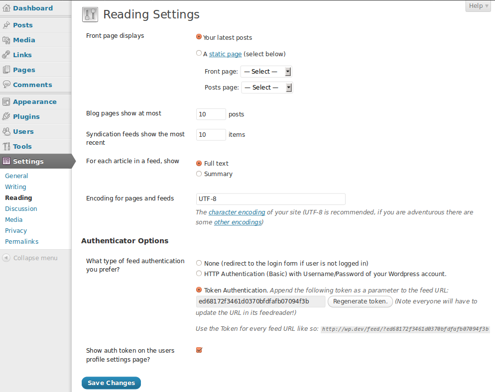
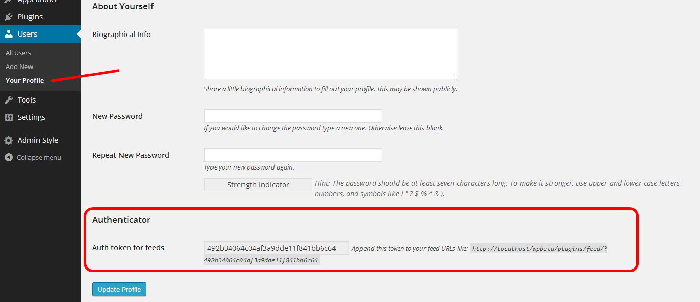

# Authenticator

This plugin allows you to make your WordPress site accessible to logged in users only.

## Description
This plugin allows you to make your WordPress site accessible to logged in users only. In other words, to view your site they have to create or have an account on your site and be logged in. No configuration necessary, simply activating - that's all.

### Made by [Inpsyde](https://inpsyde.com) &middot; We love WordPress

## Installation
### Requirements
* WordPress version 1.5 and later.
* PHP 5.2 and later.
* Single or Multisite installation.

On PHP-CGI setups:

- `mod_setenvif` or `mod_rewrite` (if you want to user HTTP authentication for feeds).

### Installation
1. Unzip the downloaded package.
2. Upload folder include the file to the `/wp-content/plugins/` directory.
3. Activate the plugin through the `Plugins` menu in WordPress.

Or use the installer via the back end of WordPress.

### On PHP-CGI setups
If you want to use HTTP authentication for feeds (available since 1.1.0 as an *optional* feature) you have to update your `.htaccess` file. If [mod_setenvif](http://httpd.apache.org/docs/2.0/mod/mod_setenvif.html) is available, add the following line to your `.htaccess`:

```
SetEnvIfNoCase ^Authorization$ "(.+)" HTTP_AUTHORIZATION=$1
```

Otherwise you need [mod_rewrite](http://httpd.apache.org/docs/current/mod/mod_rewrite.html) to be enabled. In this case you have to add the following line to your `.htaccess`:

```
RewriteRule .* - [E=HTTP_AUTHORIZATION:%{HTTP:Authorization}]
```

In a typical WordPress `.htaccess` it all looks like:

```
<IfModule mod_rewrite.c>
RewriteEngine On
RewriteBase /
RewriteRule ^index\.php$ - [L]
RewriteCond %{REQUEST_FILENAME} !-f
RewriteCond %{REQUEST_FILENAME} !-d
RewriteRule .* - [E=HTTP_AUTHORIZATION:%{HTTP:Authorization}]
RewriteRule . /index.php [L]
</IfModule>
```

On a multisite installation:

```
# BEGIN WordPress
RewriteEngine On
RewriteBase /
RewriteRule ^index\.php$ - [L]

# uploaded files
RewriteRule ^files/(.+) wp-includes/ms-files.php?file=$1 [L]

RewriteCond %{REQUEST_FILENAME} -f [OR]
RewriteCond %{REQUEST_FILENAME} -d
RewriteRule ^ - [L]

RewriteRule .* - [E=HTTP_AUTHORIZATION:%{HTTP:Authorization}]
RewriteRule . index.php [L]
# END WordPress
```
## Settings
You can change the settings of Authenticator in Settings → Reading. The settings refer to the behavior of your blog's feeds. They can be protected by HTTP authentication (not all feed readers support this) or by an authentication token which is added to your feed URL as a parameter. The third option is to keep everything in place. So feed URLs will be redirected to the login page if the user is not logged in (send no auth-cookie).

If you using token authentication, you can show the token to the blog users on their profile settings page by setting this option.

### HTTP Auth
Users can gain access to the feed with their username and password.

### Token Auth
The plugin will generate a token automatically when choosing this option. Copy this token and share it with the people who should have access to your feed. If your token is `ef05aa961a0c10dce006284213727730` the feed URLs look like so:

```
# Main feed
https://example.com/feed/?ef05aa961a0c10dce006284213727730

# Main comment feed
https://example.com/comments/feed/?ef05aa961a0c10dce006284213727730

# Without permalinks
https://example.com/?feed=rss2&ef05aa961a0c10dce006284213727730
```

## Screenshots
1. Authenticator's setting options at Settings → Reading.


2. Auth token for feeds is displayed on the users profile settings page.


## API
### Filters
* `authenticator_get_options` gives you access to the current authentication token:

    ```php
    $authenticator_options = apply_filters( 'authenticator_get_options', array() );
    ```

* `authenticator_bypass` gives you the possibility to completely bypass the authentication. No authentication will be required then.

    ```php
    add_filter( 'authenticator_bypass', '__return_true' );
    ```

* `authenticator_bypass_feed_auth` gives you the possibility to open the feeds for everyone. No authentication will be required then.

    ```php
    add_filter( 'authenticator_bypass_feed_auth', '__return_true' );
    ```

* `authenticator_exclude_pagenows` Pass an array of `$GLOBALS[ 'pagenow' ]` values to it, to exclude several WordPress pages from redirecting to the login page.

* `authenticator_exclude_ajax_actions` AJAX-Actions (independend of `_nopriv`) which should not be authenticated (remain open for everyone)

* `authenticator_exclude_posts` List of post-titles which should remain public, like the follow example source to public the 'Contact'-page.

    ```php
    add_action( 'plugins_loaded', function() {
        add_filter( 'authenticator_exclude_posts', function( $titles ) {
            $titles[] = 'Contact'; // here goes the post-title of the post/page you want to exclude
            return $titles;
        } );
    } );
    ```

## Other Notes
### Bugs, technical hints or contribute
Please give me feedback, contribute and file technical bugs on [GitHub Repo](https://github.com/bueltge/authenticator).

### Authors, Contributors
[Contributors Stats](https://github.com/bueltge/Authenticator/graphs/contributors)

### License
Good news, this plugin is free for everyone! Since it's released under the [GPL](./license.txt), you can use it free of charge on your personal or commercial blog.

### Translations
The plugin comes with various translations, please refer to the [WordPress Codex](https://codex.wordpress.org/Installing_WordPress_in_Your_Language) for more information about activating the translation. If you want to help to translate the plugin to your language, please have a look at the [wordpress.org page](https://wordpress.org/plugins/authenticator/), that have a helpful management to contribute to the translations.

## Change Log
See [commits](https://github.com/bueltge/Authenticator/commits/master) or read the short [version](https://wordpress.org/plugins/authenticator/#developers)
